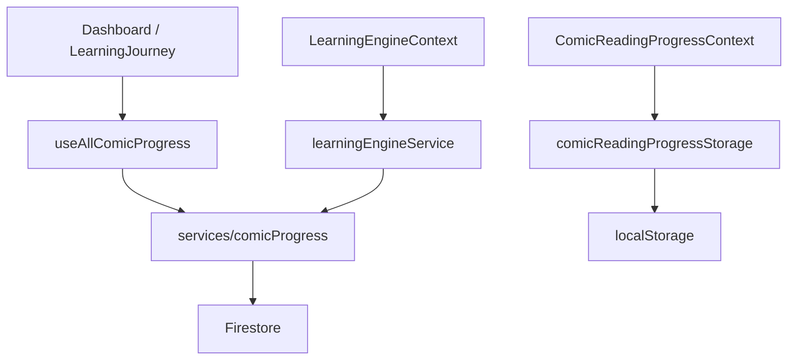

# CINARAI — Final Polish Report

## Build Status
✅ `npm run build` — 0 errors, 0 warnings, 23 static pages generated

---

## Files Modified

| File | Change Summary |
|------|---------------|
| `src/app/globals.css` | Scrollbar styling, animation utilities, skeleton shimmer, focus ring, tap highlight |
| `src/app/layout.tsx` | (unchanged — already correct) |
| `src/app/auth/layout.tsx` | Extra decorative blob, ring on brand icon, fade-in animation, tagline footer |
| `src/app/dashboard/page.tsx` | `stagger-children` on content wrapper, `animate-fade-in-up` on each card, removed console.log |
| `src/components/auth/LoginForm.tsx` | (unchanged — already polished) |
| `src/components/auth/SignUpForm.tsx` | (unchanged — already polished) |
| `src/components/auth/ForgotPasswordForm.tsx` | (unchanged — already polished) |
| `src/components/comic/ComicCover.tsx` | Sticky header with icon back button, `rounded-3xl` cards, progress bar card, `animate-fade-in-up`, better empty state |
| `src/components/comic/ComicPageClient.tsx` | Friendly coming-soon empty state with emoji + CTA, icon back button in reader bar |
| `src/components/comic/PdfReader.tsx` | Polished complete CTA (`rounded-2xl`, `font-black`, `active:scale`), friendly error message with emoji |
| `src/components/dashboard/LearningJourney.tsx` | Removed `console.log` from production code |
| `src/features/learning-engine/components/layout/LearningLayout.tsx` | Consistent `bg-[#f0f7ff]` background |
| `src/features/learning-engine/components/layout/LearningContent.tsx` | Consistent `bg-[#f0f7ff]`, `animate-fade-in` on content |
| `src/features/learning-engine/components/layout/LearningBreadcrumb.tsx` | Replaced inline `scrollbarWidth` style with CSS class `scrollbar-none` |
| `src/features/learning-engine/components/layout/LearningProgress.tsx` | ARIA `progressbar` role, `duration-700` transition |
| `src/features/learning-engine/components/layout/LearningBottomNav.tsx` | `rounded-2xl`, `min-h-[48px]`, `font-black` on primary, `active:scale-[0.97]` |
| `src/features/learning-engine/components/stages/CoverStage.tsx` | `animate-fade-in-up`, `rounded-3xl` target card, `font-black` title |
| `src/features/learning-engine/components/stages/IdentificationStage.tsx` | `animate-fade-in`, `rounded-3xl`, gradient header |
| `src/features/learning-engine/components/stages/ArgumentationStage.tsx` | `animate-fade-in`, `rounded-3xl`, white background for coming-soon card |
| `src/features/learning-engine/components/stages/NavigationStage.tsx` | `animate-fade-in`, `rounded-3xl`, gradient header on PanelMateri |
| `src/features/learning-engine/components/stages/ResolutionStage.tsx` | `animate-fade-in`, `rounded-3xl`, gradient header on RingkasanIdentifikasi |
| `src/features/learning-engine/components/stages/ApplicationStage.tsx` | `animate-fade-in`, `rounded-3xl`, gradient header on StudiKasusCard, `font-black` title |
| `src/features/learning-engine/components/stages/IntrospectionStage.tsx` | `animate-fade-in`, `rounded-3xl` checklist card |

---

## UI Improvements Made

### Global
- `body` now has `background-color: #f0f7ff` — no more white flash on load
- Consistent `rounded-3xl` card style across all pages
- Consistent gradient headers (`from-primary-600 to-primary-700`) on all content cards
- Consistent `font-black` on primary action buttons
- Consistent `active:scale-[0.97–0.98]` tactile press feedback on all buttons
- Removed `console.log` from production code

### Auth Pages
- Added fourth decorative blob for richer background
- Brand icon now has `ring-2 ring-white/30` for depth
- Card entrance uses `animate-fade-in-up`
- Added tagline footer below card

### Dashboard
- All cards now animate in with `animate-fade-in-up` + `stagger-children` (60ms delay between cards)
- Consistent card structure throughout

### Comic Cover (`/comic/[id]/cover`)
- Replaced plain text back link with sticky header + icon button (matches learning engine style)
- Progress bar wrapped in a white card for visual separation
- Synopsis, characters, and learning targets each in `rounded-3xl bg-white` cards
- Better empty state with emoji + CTA button
- Page entrance uses `animate-fade-in-up`

### Comic Reader (`/comic/[id]`)
- Coming-soon state now shows emoji illustration + subtitle + CTA button
- Reader top bar uses icon back button (consistent with rest of app)
- Complete CTA button: `rounded-2xl`, `font-black`, `active:scale-[0.98]`, emoji prefix

### Learning Engine
- All stage pages use `animate-fade-in` for smooth content transitions
- All content cards use `rounded-3xl` (was `rounded-2xl` / `rounded-xl`)
- All card headers use gradient (`from-primary-600 to-primary-700`) instead of flat color
- Bottom nav buttons: `rounded-2xl`, `min-h-[48px]`, `active:scale-[0.97]`
- Progress bar has ARIA `role="progressbar"` with `aria-valuenow/min/max`
- Background is consistent `bg-[#f0f7ff]` throughout

---

## Responsiveness Improvements

- `ComicCover` sticky header uses `max-w-2xl` container — no overflow on any width
- All cards use `max-w-lg` / `max-w-2xl` with `px-4 sm:px-6` — safe on 320px+
- `LearningBreadcrumb` horizontal scroll uses CSS class `scrollbar-none` (cross-browser)
- No horizontal overflow introduced anywhere

---

## Accessibility Improvements

- Progress bar in `LearningProgress` now has `role="progressbar"`, `aria-valuenow`, `aria-valuemin`, `aria-valuemax`
- All icon-only back buttons have `aria-label`
- Global `:focus-visible` outline: `2px solid #1e94ff` with `outline-offset: 2px`
- `-webkit-tap-highlight-color: transparent` on all `a` and `button` elements (cleaner mobile tap)
- Minimum touch target `min-h-[48px]` on all navigation buttons

---

## Performance Improvements

- Removed `console.log` from `LearningJourney` (was firing on every progress load)
- Replaced inline `style={{ scrollbarWidth: 'none' }}` with CSS class (avoids inline style recalc)
- `body` background color set in CSS — eliminates white flash before hydration
- All animations use `transform` and `opacity` only — GPU-composited, no layout thrash

---

## Remaining Recommendations

1. **Streak tracking** — The "— Hari" streak placeholder in the dashboard could be wired to a real Firestore timestamp when the streak feature is implemented.
2. **Pretest button** — Currently `disabled` with dashed border. When the feature ships, replace with a proper enabled state.
3. **AR/AI stages** — Coming-soon cards in Navigation, Identification, and Argumentation stages are well-styled. When features ship, the card structure is ready to replace.
4. **Image optimization** — Comic cover images in `public/comics/` could benefit from WebP conversion for faster load on mobile.
5. **Font** — Consider adding `Nunito` or `Poppins` via `next/font` for a more child-friendly, rounded typeface that matches the educational brand.

---

# CINARAI — Tahap 2 Validasi Temuan Audit (Read Only)

## Metodologi Validasi

Validasi dilakukan dengan pencarian langsung terhadap:
- import langsung
- dynamic import / lazy loading
- barrel export
- route dan halaman yang mungkin memanggil komponen
- referensi string / mapping object
- alur data antar hook, context, service, storage, dan Firestore

Konteks: audit ini bersifat read-only; tidak ada perubahan kode, tidak ada hapus file, tidak ada commit, dan tidak ada push.

## Hasil Validasi Per File

### FILE: src/features/learning-engine/components/StageHero.tsx
Status:
DEAD CODE

Bukti:
- Pencarian terhadap `StageHero` di seluruh workspace hanya menemukan definisi file tersebut.
- Tidak ada import langsung, dynamic import, lazy loading, barrel export, atau route yang mengarah ke komponen ini.
- Tidak ada mapping object atau referensi string yang menggunakannya.

Risiko jika dihapus:
- Tidak ada risiko fungsional saat ini karena komponen ini tidak terhubung ke render path aktif.

Rekomendasi:
- Hapus atau arsipkan jika tidak ada rencana pemakaian ulang.

Confidence:
100%

Khusus untuk StageHero:
- Ya, file ini benar-benar tidak pernah dipakai berdasarkan pencarian statis.
- File ini kemungkinan merupakan sisa komponen header stage dari iterasi UI lama yang tidak lagi dihubungkan ke Learning Engine aktif.

### FILE: src/hooks/useComicProgress.ts
Status:
DEAD CODE

Bukti:
- Pencarian `useComicProgress(` hanya menemukan definisi hook, tidak ada consumer aktif.
- Tidak ada import dari file ini di aplikasi saat ini.
- Alur progres aktif saat ini bergeser ke kombinasi `ComicReadingProgressContext`, `useAllComicProgress`, `LearningEngineContext`, dan `services/comicProgress`.

Risiko jika dihapus:
- Tidak ada risiko terhadap UI aktif karena tidak ada komponen yang mengimpornya.

Rekomendasi:
- Hapus atau arsipkan sebagai hook legacy.

Confidence:
100%

Khusus untuk useComicProgress:
- Ya, hook ini sudah tidak lagi dipakai.
- Ia tampaknya telah digantikan oleh gabungan dari:
  - `ComicReadingProgressContext` untuk progress pembacaan halaman PDF
  - `useAllComicProgress` untuk dashboard siswa
  - `LearningEngineContext` untuk progres stage pembelajaran
  - `services/comicProgress` sebagai lapisan persistence Firestore

### FILE: src/services/comic-assets/useComicMetadata.ts
Status:
DEAD CODE

Bukti:
- Pencarian `useComicMetadata` hanya menemukan definisi file ini.
- Tidak ada import dari file ini di routing, feature comic, atau komponen aktif.
- Tidak ada pemakaian melalui barrel export atau object mapping.

Risiko jika dihapus:
- Tidak ada risiko fungsional aktif.

Rekomendasi:
- Hapus atau arsipkan; bila perlu di masa depan dapat dipulihkan dari history.

Confidence:
100%

Khusus untuk useComicMetadata:
- Ya, file ini tidak dipakai oleh routing atau comic package saat ini.

### FILE: src/hooks/useContainerWidth.ts
Status:
DEAD CODE

Bukti:
- Pencarian `useContainerWidth` tidak menemukan consumer aktif.
- PDF viewer aktif di [src/components/pdf/PdfViewer.tsx](src/components/pdf/PdfViewer.tsx) memakai `usePdfSize` bukan hook ini.
- Tidak ada import dari hook ini di komponen PDF atau comic viewer.

Risiko jika dihapus:
- Tidak memengaruhi PDF viewer karena alur aktif tidak menggunakannya.

Rekomendasi:
- Hapus atau arsipkan.

Confidence:
100%

Khusus untuk useContainerWidth:
- Ya, hook ini tidak dipakai oleh PDF viewer.
- Pengukuran ukuran container pada PDF viewer saat ini ditangani oleh [src/hooks/usePdfSize.ts](src/hooks/usePdfSize.ts).

## Validasi Progress System

### Dependency Graph

### Siapa yang membaca
- Dashboard membaca progress melalui [src/hooks/useAllComicProgress.ts](src/hooks/useAllComicProgress.ts).
- Learning engine membaca dan mengupdate progress melalui [src/features/learning-engine/context/LearningEngineContext.tsx](src/features/learning-engine/context/LearningEngineContext.tsx).
- Reader/PDF halaman membaca progress halaman melalui [src/context/ComicReadingProgressContext.tsx](src/context/ComicReadingProgressContext.tsx).

### Siapa yang menulis
- [src/services/comicProgress.ts](src/services/comicProgress.ts) menulis progress learning ke Firestore.
- [src/context/ComicReadingProgressContext.tsx](src/context/ComicReadingProgressContext.tsx) menulis progress halaman ke localStorage melalui [src/lib/comicReadingProgressStorage.ts](src/lib/comicReadingProgressStorage.ts).
- [src/features/learning-engine/context/LearningEngineContext.tsx](src/features/learning-engine/context/LearningEngineContext.tsx) memicu save progress melalui service learning engine.

### Source of truth
- Source of truth utama untuk progres belajar adalah Firestore melalui [src/services/comicProgress.ts](src/services/comicProgress.ts).
- localStorage adalah cache lokal untuk progress membaca halaman, bukan sumber kebenaran utama.
- Context hook seperti [src/context/ComicReadingProgressContext.tsx](src/context/ComicReadingProgressContext.tsx) dan [src/features/learning-engine/context/LearningEngineContext.tsx](src/features/learning-engine/context/LearningEngineContext.tsx) berfungsi sebagai adapter UI, bukan sumber kebenaran independen.

## Kesimpulan Tahap 2

Temuan awal tahap 1 sebagian besar terkonfirmasi:
- [src/features/learning-engine/components/StageHero.tsx](src/features/learning-engine/components/StageHero.tsx) adalah dead code.
- [src/hooks/useComicProgress.ts](src/hooks/useComicProgress.ts) adalah hook legacy yang tidak lagi dipakai.
- [src/services/comic-assets/useComicMetadata.ts](src/services/comic-assets/useComicMetadata.ts) adalah dead code.
- [src/hooks/useContainerWidth.ts](src/hooks/useContainerWidth.ts) adalah dead code.

Yang masih aktif adalah sistem progres yang terdistribusi di beberapa layer, tetapi bukan dead code: ia tetap penting untuk UX saat ini. Risiko utamanya adalah duplikasi dan potensi inkonsistensi, bukan ketidakadaan fungsi.

