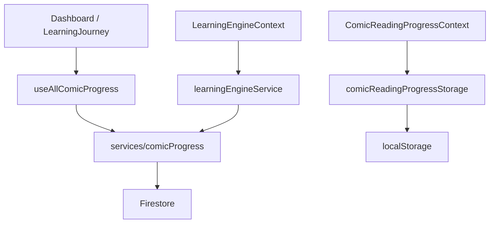
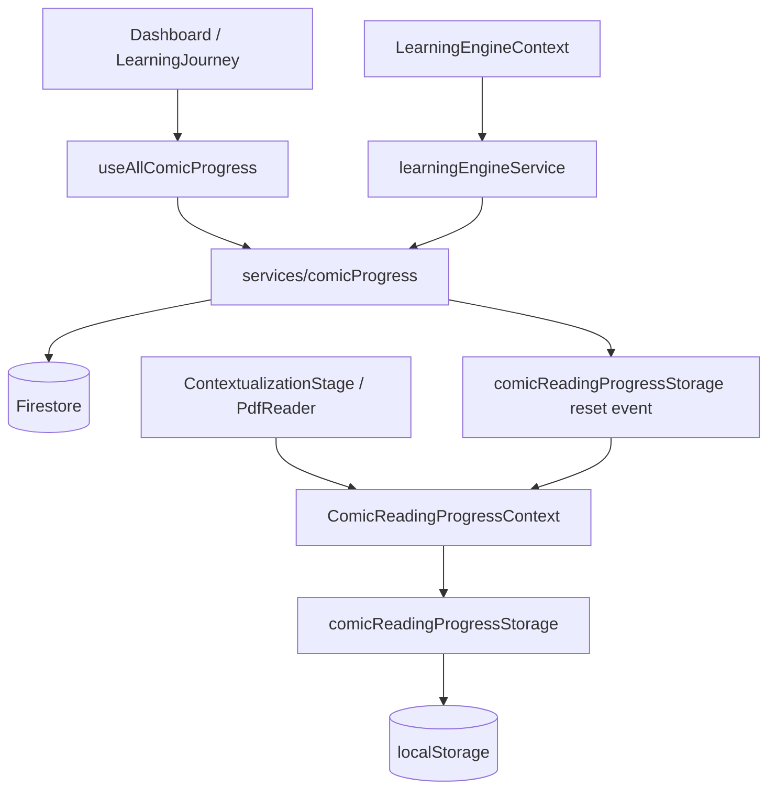

# CINARAI — Final Polish Report

## Build Status
✅ `npm run build` — 0 errors, 0 warnings, 23 static pages generated

---

## Files Modified

| File | Change Summary |
|------|---------------|
| `src/app/globals.css` | Scrollbar styling, animation utilities, skeleton shimmer, focus ring, tap highlight |
| `src/app/layout.tsx` | (unchanged — already correct) |
| `src/app/auth/layout.tsx` | Extra decorative blob, ring on brand icon, fade-in animation, tagline footer |
| `src/app/dashboard/page.tsx` | `stagger-children` on content wrapper, `animate-fade-in-up` on each card, removed console.log |
| `src/components/auth/LoginForm.tsx` | (unchanged — already polished) |
| `src/components/auth/SignUpForm.tsx` | (unchanged — already polished) |
| `src/components/auth/ForgotPasswordForm.tsx` | (unchanged — already polished) |
| `src/components/comic/ComicCover.tsx` | Sticky header with icon back button, `rounded-3xl` cards, progress bar card, `animate-fade-in-up`, better empty state |
| `src/components/comic/ComicPageClient.tsx` | Friendly coming-soon empty state with emoji + CTA, icon back button in reader bar |
| `src/components/comic/PdfReader.tsx` | Polished complete CTA (`rounded-2xl`, `font-black`, `active:scale`), friendly error message with emoji |
| `src/components/dashboard/LearningJourney.tsx` | Removed `console.log` from production code |
| `src/features/learning-engine/components/layout/LearningLayout.tsx` | Consistent `bg-[#f0f7ff]` background |
| `src/features/learning-engine/components/layout/LearningContent.tsx` | Consistent `bg-[#f0f7ff]`, `animate-fade-in` on content |
| `src/features/learning-engine/components/layout/LearningBreadcrumb.tsx` | Replaced inline `scrollbarWidth` style with CSS class `scrollbar-none` |
| `src/features/learning-engine/components/layout/LearningProgress.tsx` | ARIA `progressbar` role, `duration-700` transition |
| `src/features/learning-engine/components/layout/LearningBottomNav.tsx` | `rounded-2xl`, `min-h-[48px]`, `font-black` on primary, `active:scale-[0.97]` |
| `src/features/learning-engine/components/stages/CoverStage.tsx` | `animate-fade-in-up`, `rounded-3xl` target card, `font-black` title |
| `src/features/learning-engine/components/stages/IdentificationStage.tsx` | `animate-fade-in`, `rounded-3xl`, gradient header |
| `src/features/learning-engine/components/stages/ArgumentationStage.tsx` | `animate-fade-in`, `rounded-3xl`, white background for coming-soon card |
| `src/features/learning-engine/components/stages/NavigationStage.tsx` | `animate-fade-in`, `rounded-3xl`, gradient header on PanelMateri |
| `src/features/learning-engine/components/stages/ResolutionStage.tsx` | `animate-fade-in`, `rounded-3xl`, gradient header on RingkasanIdentifikasi |
| `src/features/learning-engine/components/stages/ApplicationStage.tsx` | `animate-fade-in`, `rounded-3xl`, gradient header on StudiKasusCard, `font-black` title |
| `src/features/learning-engine/components/stages/IntrospectionStage.tsx` | `animate-fade-in`, `rounded-3xl` checklist card |

---

## UI Improvements Made

### Global
- `body` now has `background-color: #f0f7ff` — no more white flash on load
- Consistent `rounded-3xl` card style across all pages
- Consistent gradient headers (`from-primary-600 to-primary-700`) on all content cards
- Consistent `font-black` on primary action buttons
- Consistent `active:scale-[0.97–0.98]` tactile press feedback on all buttons
- Removed `console.log` from production code

### Auth Pages
- Added fourth decorative blob for richer background
- Brand icon now has `ring-2 ring-white/30` for depth
- Card entrance uses `animate-fade-in-up`
- Added tagline footer below card

### Dashboard
- All cards now animate in with `animate-fade-in-up` + `stagger-children` (60ms delay between cards)
- Consistent card structure throughout

### Comic Cover (`/comic/[id]/cover`)
- Replaced plain text back link with sticky header + icon button (matches learning engine style)
- Progress bar wrapped in a white card for visual separation
- Synopsis, characters, and learning targets each in `rounded-3xl bg-white` cards
- Better empty state with emoji + CTA button
- Page entrance uses `animate-fade-in-up`

### Comic Reader (`/comic/[id]`)
- Coming-soon state now shows emoji illustration + subtitle + CTA button
- Reader top bar uses icon back button (consistent with rest of app)
- Complete CTA button: `rounded-2xl`, `font-black`, `active:scale-[0.98]`, emoji prefix

### Learning Engine
- All stage pages use `animate-fade-in` for smooth content transitions
- All content cards use `rounded-3xl` (was `rounded-2xl` / `rounded-xl`)
- All card headers use gradient (`from-primary-600 to-primary-700`) instead of flat color
- Bottom nav buttons: `rounded-2xl`, `min-h-[48px]`, `active:scale-[0.97]`
- Progress bar has ARIA `role="progressbar"` with `aria-valuenow/min/max`
- Background is consistent `bg-[#f0f7ff]` throughout

---

## Responsiveness Improvements

- `ComicCover` sticky header uses `max-w-2xl` container — no overflow on any width
- All cards use `max-w-lg` / `max-w-2xl` with `px-4 sm:px-6` — safe on 320px+
- `LearningBreadcrumb` horizontal scroll uses CSS class `scrollbar-none` (cross-browser)
- No horizontal overflow introduced anywhere

---

## Accessibility Improvements

- Progress bar in `LearningProgress` now has `role="progressbar"`, `aria-valuenow`, `aria-valuemin`, `aria-valuemax`
- All icon-only back buttons have `aria-label`
- Global `:focus-visible` outline: `2px solid #1e94ff` with `outline-offset: 2px`
- `-webkit-tap-highlight-color: transparent` on all `a` and `button` elements (cleaner mobile tap)
- Minimum touch target `min-h-[48px]` on all navigation buttons

---

## Performance Improvements

- Removed `console.log` from `LearningJourney` (was firing on every progress load)
- Replaced inline `style={{ scrollbarWidth: 'none' }}` with CSS class (avoids inline style recalc)
- `body` background color set in CSS — eliminates white flash before hydration
- All animations use `transform` and `opacity` only — GPU-composited, no layout thrash

---

## Remaining Recommendations

1. **Streak tracking** — The "— Hari" streak placeholder in the dashboard could be wired to a real Firestore timestamp when the streak feature is implemented.
2. **Pretest button** — Currently `disabled` with dashed border. When the feature ships, replace with a proper enabled state.
3. **AR/AI stages** — Coming-soon cards in Navigation, Identification, and Argumentation stages are well-styled. When features ship, the card structure is ready to replace.
4. **Image optimization** — Comic cover images in `public/comics/` could benefit from WebP conversion for faster load on mobile.
5. **Font** — Consider adding `Nunito` or `Poppins` via `next/font` for a more child-friendly, rounded typeface that matches the educational brand.

---

# CINARAI — Tahap 2 Validasi Temuan Audit (Read Only)

## Metodologi Validasi

Validasi dilakukan dengan pencarian langsung terhadap:
- import langsung
- dynamic import / lazy loading
- barrel export
- route dan halaman yang mungkin memanggil komponen
- referensi string / mapping object
- alur data antar hook, context, service, storage, dan Firestore

Konteks: audit ini bersifat read-only; tidak ada perubahan kode, tidak ada hapus file, tidak ada commit, dan tidak ada push.

## Hasil Validasi Per File

### FILE: src/features/learning-engine/components/StageHero.tsx
Status:
DEAD CODE

Bukti:
- Pencarian terhadap `StageHero` di seluruh workspace hanya menemukan definisi file tersebut.
- Tidak ada import langsung, dynamic import, lazy loading, barrel export, atau route yang mengarah ke komponen ini.
- Tidak ada mapping object atau referensi string yang menggunakannya.

Risiko jika dihapus:
- Tidak ada risiko fungsional saat ini karena komponen ini tidak terhubung ke render path aktif.

Rekomendasi:
- Hapus atau arsipkan jika tidak ada rencana pemakaian ulang.

Confidence:
100%

Khusus untuk StageHero:
- Ya, file ini benar-benar tidak pernah dipakai berdasarkan pencarian statis.
- File ini kemungkinan merupakan sisa komponen header stage dari iterasi UI lama yang tidak lagi dihubungkan ke Learning Engine aktif.

### FILE: src/hooks/useComicProgress.ts
Status:
DEAD CODE

Bukti:
- Pencarian `useComicProgress(` hanya menemukan definisi hook, tidak ada consumer aktif.
- Tidak ada import dari file ini di aplikasi saat ini.
- Alur progres aktif saat ini bergeser ke kombinasi `ComicReadingProgressContext`, `useAllComicProgress`, `LearningEngineContext`, dan `services/comicProgress`.

Risiko jika dihapus:
- Tidak ada risiko terhadap UI aktif karena tidak ada komponen yang mengimpornya.

Rekomendasi:
- Hapus atau arsipkan sebagai hook legacy.

Confidence:
100%

Khusus untuk useComicProgress:
- Ya, hook ini sudah tidak lagi dipakai.
- Ia tampaknya telah digantikan oleh gabungan dari:
  - `ComicReadingProgressContext` untuk progress pembacaan halaman PDF
  - `useAllComicProgress` untuk dashboard siswa
  - `LearningEngineContext` untuk progres stage pembelajaran
  - `services/comicProgress` sebagai lapisan persistence Firestore

### FILE: src/services/comic-assets/useComicMetadata.ts
Status:
DEAD CODE

Bukti:
- Pencarian `useComicMetadata` hanya menemukan definisi file ini.
- Tidak ada import dari file ini di routing, feature comic, atau komponen aktif.
- Tidak ada pemakaian melalui barrel export atau object mapping.

Risiko jika dihapus:
- Tidak ada risiko fungsional aktif.

Rekomendasi:
- Hapus atau arsipkan; bila perlu di masa depan dapat dipulihkan dari history.

Confidence:
100%

Khusus untuk useComicMetadata:
- Ya, file ini tidak dipakai oleh routing atau comic package saat ini.

### FILE: src/hooks/useContainerWidth.ts
Status:
DEAD CODE

Bukti:
- Pencarian `useContainerWidth` tidak menemukan consumer aktif.
- PDF viewer aktif di [src/components/pdf/PdfViewer.tsx](src/components/pdf/PdfViewer.tsx) memakai `usePdfSize` bukan hook ini.
- Tidak ada import dari hook ini di komponen PDF atau comic viewer.

Risiko jika dihapus:
- Tidak memengaruhi PDF viewer karena alur aktif tidak menggunakannya.

Rekomendasi:
- Hapus atau arsipkan.

Confidence:
100%

Khusus untuk useContainerWidth:
- Ya, hook ini tidak dipakai oleh PDF viewer.
- Pengukuran ukuran container pada PDF viewer saat ini ditangani oleh [src/hooks/usePdfSize.ts](src/hooks/usePdfSize.ts).

## Validasi Progress System

### Dependency Graph



### Siapa yang membaca
- Dashboard membaca progress melalui [src/hooks/useAllComicProgress.ts](src/hooks/useAllComicProgress.ts).
- Learning engine membaca dan mengupdate progress melalui [src/features/learning-engine/context/LearningEngineContext.tsx](src/features/learning-engine/context/LearningEngineContext.tsx).
- Reader/PDF halaman membaca progress halaman melalui [src/context/ComicReadingProgressContext.tsx](src/context/ComicReadingProgressContext.tsx).

### Siapa yang menulis
- [src/services/comicProgress.ts](src/services/comicProgress.ts) menulis progress learning ke Firestore.
- [src/context/ComicReadingProgressContext.tsx](src/context/ComicReadingProgressContext.tsx) menulis progress halaman ke localStorage melalui [src/lib/comicReadingProgressStorage.ts](src/lib/comicReadingProgressStorage.ts).
- [src/features/learning-engine/context/LearningEngineContext.tsx](src/features/learning-engine/context/LearningEngineContext.tsx) memicu save progress melalui service learning engine.

### Source of truth
- Source of truth utama untuk progres belajar adalah Firestore melalui [src/services/comicProgress.ts](src/services/comicProgress.ts).
- localStorage adalah cache lokal untuk progress membaca halaman, bukan sumber kebenaran utama.
- Context hook seperti [src/context/ComicReadingProgressContext.tsx](src/context/ComicReadingProgressContext.tsx) dan [src/features/learning-engine/context/LearningEngineContext.tsx](src/features/learning-engine/context/LearningEngineContext.tsx) berfungsi sebagai adapter UI, bukan sumber kebenaran independen.

## Kesimpulan Tahap 2

Temuan awal tahap 1 sebagian besar terkonfirmasi:
- [src/features/learning-engine/components/StageHero.tsx](src/features/learning-engine/components/StageHero.tsx) adalah dead code.
- [src/hooks/useComicProgress.ts](src/hooks/useComicProgress.ts) adalah hook legacy yang tidak lagi dipakai.
- [src/services/comic-assets/useComicMetadata.ts](src/services/comic-assets/useComicMetadata.ts) adalah dead code.
- [src/hooks/useContainerWidth.ts](src/hooks/useContainerWidth.ts) adalah dead code.

---

# CINARAI — Tahap 4 Arsitektur Sistem Progress (Read Only)

## Scope audit

Audit ini memetakan seluruh alur progress yang terlibat dalam:
- pembelajaran stage
- resume halaman PDF / comic reader
- reset progress
- dashboard
- report / teacher view
- persistence ke Firestore dan localStorage

Tidak ada perubahan kode dilakukan.

## Inventaris file yang terlibat

| Nama File | Peran | Bukti dari kode |
|---|---|---|
| [src/services/comicProgress.ts](src/services/comicProgress.ts) | READ / WRITE / RESET / SYNC | Menyimpan, mereset, dan subscribe ke progress belajar di Firestore; dipakai oleh hook, context, dan learning-engine service. |
| [src/features/learning-engine/context/LearningEngineContext.tsx](src/features/learning-engine/context/LearningEngineContext.tsx) | READ / WRITE / RESET / SYNC | Membaca snapshot progress dari Firestore, menyimpan stage completion, dan mereset progress pembelajaran saat user ulangi. |
| [src/features/learning-engine/services/learningEngineService.ts](src/features/learning-engine/services/learningEngineService.ts) | WRITE / RESET / SYNC | Adapter tipis yang memanggil service progress utama untuk save/reset. |
| [src/lib/progressEngine.ts](src/lib/progressEngine.ts) | WRITE / READ (domain transform) | Membuat state awal, menandai stage selesai, dan mengembalikan state dari sintaks list. |
| [src/context/ComicReadingProgressContext.tsx](src/context/ComicReadingProgressContext.tsx) | READ / WRITE / RESET / SYNC | Menyimpan progress halaman PDF di memory context dan meng-sync ke localStorage. |
| [src/lib/comicReadingProgressStorage.ts](src/lib/comicReadingProgressStorage.ts) | READ / WRITE / RESET | API storage untuk localStorage dan event reset. |
| [src/hooks/useAllComicProgress.ts](src/hooks/useAllComicProgress.ts) | READ / RESET / SYNC | Hook dashboard yang subscribe ke semua progress komik user dari Firestore dan memicu reset. |
| [src/components/dashboard/LearningJourney.tsx](src/components/dashboard/LearningJourney.tsx) | READ / RESET | UI dashboard membaca progress untuk menampilkan status dan memicu reset. |
| [src/components/comic/PdfReader.tsx](src/components/comic/PdfReader.tsx) | READ | Membaca last page resume dari context saat memulai PDF. |
| [src/features/learning-engine/components/stages/ContextualizationStage.tsx](src/features/learning-engine/components/stages/ContextualizationStage.tsx) | READ / WRITE / SYNC | Menyimpan page progress saat user membaca PDF dan memicu complete stage. |
| [src/features/learning-engine/stages/Identification/hooks/useIdentification.ts](src/features/learning-engine/stages/Identification/hooks/useIdentification.ts) | READ | Membaca last page dari context untuk mengisi source page identifikasi. |
| [src/context/AuthContext.tsx](src/context/AuthContext.tsx) | WRITE | Memanggil initializeUserProgress saat login/register agar dokumen progress dibuat. |
| [src/app/report/ReportClient.tsx](src/app/report/ReportClient.tsx) | READ | Membaca dokumen progress dari Firestore untuk tampilan report per komik. |
| [src/app/teacher/report/TeacherReportClient.tsx](src/app/teacher/report/TeacherReportClient.tsx) | READ | Membaca banyak dokumen progress dari Firestore untuk report guru. |
| [src/services/firestore.ts](src/services/firestore.ts) | READ / WRITE helper | Mendefinisikan collection map dan helper akses Firestore; bukan source of truth sendiri tetapi titik akses data. |

## Dependency graph



## Peran tiap node

### Dashboard
- Input: daftar komik + state progress user
- Output: status belajar, persentase, tombol reset
- Dependency: [src/hooks/useAllComicProgress.ts](src/hooks/useAllComicProgress.ts), [src/components/dashboard/LearningJourney.tsx](src/components/dashboard/LearningJourney.tsx)

### LearningEngineContext
- Input: auth user, current stage, stage completion event
- Output: progress state pembelajaran, stage index, reset progress
- Dependency: [src/features/learning-engine/services/learningEngineService.ts](src/features/learning-engine/services/learningEngineService.ts), [src/services/comicProgress.ts](src/services/comicProgress.ts)

### ComicReadingProgressContext
- Input: page change, complete reading, reset event
- Output: last page, completed flag, current page state
- Dependency: [src/lib/comicReadingProgressStorage.ts](src/lib/comicReadingProgressStorage.ts)

### comicProgress.ts
- Input: userId, ComicProgressState, comicId
- Output: Firestore doc progress, subscribe callback, reset result
- Dependency: [src/lib/progressEngine.ts](src/lib/progressEngine.ts), [src/lib/comicReadingProgressStorage.ts](src/lib/comicReadingProgressStorage.ts)

### comicReadingProgressStorage
- Input: storage key, comicId, page number
- Output: JSON payload ke localStorage dan event reset
- Dependency: browser localStorage

## Duplicate source of truth

### 1. Duplicate progress model
Ada dua domain progress yang berbeda tetapi saling tumpang tindih:
- learning progress stage: disimpan di Firestore sebagai dokumen progress per komik
- reading progress page: disimpan di localStorage sebagai resume halaman

### 2. Duplicate context / provider
Ada dua konteks yang mengelola progress yang berbeda:
- [src/features/learning-engine/context/LearningEngineContext.tsx](src/features/learning-engine/context/LearningEngineContext.tsx) untuk perjalanan belajar stage
- [src/context/ComicReadingProgressContext.tsx](src/context/ComicReadingProgressContext.tsx) untuk resume halaman pembaca

Keduanya hidup berdampingan dan berhubungan melalui provider yang dipasang bersama di [src/features/learning-engine/components/LearningEngine.tsx](src/features/learning-engine/components/LearningEngine.tsx).

### 3. Duplicate cache pattern
- Learning progress disimpan di memory state dalam LearningEngineContext dan juga di Firestore
- Reading progress disimpan di memory state dalam ComicReadingProgressContext dan juga di localStorage

Ini bukan bug, tetapi memperlihatkan pola cache + source of truth yang tersebar.

## Jawaban pertanyaan arsitektur

### 1. Siapa source of truth sekarang?
Saat ini ada dua sumber kebenaran yang aktif:
- Firestore: sumber kebenaran untuk progress belajar stage per komik
- localStorage: sumber kebenaran untuk resume halaman pembaca PDF

### 2. Berapa jumlah source of truth?
Secara praktis ada 2 sumber kebenaran yang terpisah.

### 3. Harusnya menjadi berapa?
Idealnya sebaiknya menjadi 2 total saja:
- 1 authoritative progress store untuk learning progress (Firestore-backed)
- 1 lightweight local resume cache untuk reader (localStorage-backed)

Jadi bukan banyak lapisan state yang masing-masing bertindak seperti sumber kebenaran.

### 4. File mana yang harus dipertahankan
File inti yang sebaiknya dipertahankan:
- [src/services/comicProgress.ts](src/services/comicProgress.ts)
- [src/lib/progressEngine.ts](src/lib/progressEngine.ts)
- [src/lib/comicReadingProgressStorage.ts](src/lib/comicReadingProgressStorage.ts)
- [src/context/ComicReadingProgressContext.tsx](src/context/ComicReadingProgressContext.tsx)
- [src/features/learning-engine/context/LearningEngineContext.tsx](src/features/learning-engine/context/LearningEngineContext.tsx)
- [src/hooks/useAllComicProgress.ts](src/hooks/useAllComicProgress.ts)

### 5. File mana yang harus dihapus
File dead code yang sudah tervalidasi dan tidak lagi dipakai:
- [src/features/learning-engine/components/StageHero.tsx](src/features/learning-engine/components/StageHero.tsx)
- [src/hooks/useComicProgress.ts](src/hooks/useComicProgress.ts)
- [src/services/comic-assets/useComicMetadata.ts](src/services/comic-assets/useComicMetadata.ts)
- [src/hooks/useContainerWidth.ts](src/hooks/useContainerWidth.ts)

### 6. File mana yang harus digabung
Rekomendasi penggabungan arsitektur:
- Gabungkan [src/features/learning-engine/services/learningEngineService.ts](src/features/learning-engine/services/learningEngineService.ts) dan [src/services/comicProgress.ts](src/services/comicProgress.ts) menjadi satu service progress domain yang konsisten.
- Gabungkan [src/context/ComicReadingProgressContext.tsx](src/context/ComicReadingProgressContext.tsx) dan [src/lib/comicReadingProgressStorage.ts](src/lib/comicReadingProgressStorage.ts) ke dalam satu adapter resume-progress yang lebih sederhana.
- Gabungkan logika subscribe/reset di [src/hooks/useAllComicProgress.ts](src/hooks/useAllComicProgress.ts) dengan LearningEngineContext agar tidak ada dua mekanisme subscription yang memelihara state secara terpisah.

## Kesimpulan

Arsitektur progress saat ini bekerja, tetapi memiliki pola yang terlalu tersebar:
- satu domain untuk learning stage progress
- satu domain terpisah untuk reader resume progress
- beberapa layer state dan storage yang mengelola hal yang sama dari sudut pandang yang berbeda

Solusi terbaik adalah mempertahankan satu model progress inti dan satu adapter storage per concern, bukan banyak konteks dan cache yang saling meniru.

---

# CINARAI — Tahap 5 Desain Arsitektur Multi-Comic (Read Only)

## Tujuan desain

Menjamin bahwa progress Komik 1 tidak pernah memengaruhi Komik 2, 3, 4, atau 5. Desain ini menempatkan identity komik sebagai kunci utama pada setiap operasi progress.

Tidak ada perubahan kode dilakukan.

## 1. Diagram progress per komik

```mermaid
flowchart TD
    U[User] --> L[LearningEngineContext]
    U --> R[ComicReadingProgressContext]

    L --> S[services/comicProgress]
    S --> F[(Firestore)]
    F --> D1[users/{uid}/progress/comic-1]
    F --> D2[users/{uid}/progress/comic-2]
    F --> D3[users/{uid}/progress/comic-3]
    F --> D4[users/{uid}/progress/comic-4]
    F --> D5[users/{uid}/progress/comic-5]

    R --> T[comicReadingProgressStorage]
    T --> L1[localStorage: comic-reader-comic-1]
    T --> L2[localStorage: comic-reader-comic-2]
    T --> L3[localStorage: comic-reader-comic-3]
    T --> L4[localStorage: comic-reader-comic-4]
    T --> L5[localStorage: comic-reader-comic-5]

    D1 --> Report[Report per comic]
    D2 --> Report
    D3 --> Report
    D4 --> Report
    D5 --> Report

    D1 --> Dashboard[Dashboard aggregation]
    D2 --> Dashboard
    D3 --> Dashboard
    D4 --> Dashboard
    D5 --> Dashboard
```

## 2. Storage Firestore

### Pola yang dipakai saat ini
- Progress belajar disimpan per dokumen Firestore dengan path:
  - [src/services/comicProgress.ts](src/services/comicProgress.ts)
- Dokumen dibangun dari `comicId` dan ditulis ke path `users/{uid}/progress/comic-{comicId}`.

### Struktur yang direkomendasikan
- Setiap komik punya dokumen sendiri:
  - `users/{uid}/progress/comic-1`
  - `users/{uid}/progress/comic-2`
  - `users/{uid}/progress/comic-3`
  - `users/{uid}/progress/comic-4`
  - `users/{uid}/progress/comic-5`

### Field inti per dokumen
- `comicId`
- `completedStage`
- `completedPages`
- `percentage`
- `status`
- `sintaksList`
- `introspection`
- `updatedAt`

### Kunci identitas yang harus dipakai
- `comicId` numeric sebagai identity domain
- `progressDocId` canonical: `comic-${comicId}`

## 3. Storage localStorage

### Pola yang dipakai saat ini
- Progress halaman reader saat ini disimpan dalam satu objek payload di localStorage melalui [src/lib/comicReadingProgressStorage.ts](src/lib/comicReadingProgressStorage.ts).
- Kunci objek adalah `comicId`, sehingga entri untuk setiap komik dipisahkan secara logical.

### Struktur yang direkomendasikan
Agar lebih eksplisit dan aman, gunakan satu entry per komik, misalnya:
- `comic-reader-comic-1`
- `comic-reader-comic-2`
- `comic-reader-comic-3`
- `comic-reader-comic-4`
- `comic-reader-comic-5`

Atau, jika tetap ingin satu namespace, maka key internal harus selalu mencantumkan `comicId`:
- `cinarai:reader-progress:comic-1`
- `cinarai:reader-progress:comic-2`
- `cinarai:reader-progress:comic-3`
- `cinarai:reader-progress:comic-4`
- `cinarai:reader-progress:comic-5`

## 4. Ownership

### Learning progress ownership
- [src/features/learning-engine/context/LearningEngineContext.tsx](src/features/learning-engine/context/LearningEngineContext.tsx) memegang state dan memicu save/reset per comic.
- [src/services/comicProgress.ts](src/services/comicProgress.ts) adalah owner persistence ke Firestore.

### Reader resume ownership
- [src/context/ComicReadingProgressContext.tsx](src/context/ComicReadingProgressContext.tsx) adalah owner state resume halaman per comic.
- [src/lib/comicReadingProgressStorage.ts](src/lib/comicReadingProgressStorage.ts) adalah owner storage layer untuk localStorage.

### Dashboard ownership
- [src/hooks/useAllComicProgress.ts](src/hooks/useAllComicProgress.ts) dan [src/components/dashboard/LearningJourney.tsx](src/components/dashboard/LearningJourney.tsx) hanya membaca dan mengagregasi data.
- Dashboard bukan source of truth.

### Report ownership
- [src/app/report/ReportClient.tsx](src/app/report/ReportClient.tsx) membaca dokumen progress dari satu comic tertentu berdasarkan `comicId`.
- [src/app/teacher/report/TeacherReportClient.tsx](src/app/teacher/report/TeacherReportClient.tsx) membaca progress per siswa dan per comic, lalu mengagregasi untuk laporan guru.

## 5. Reset flow

### Alur saat ini
Reset untuk satu komik diproses melalui:
- [src/hooks/useAllComicProgress.ts](src/hooks/useAllComicProgress.ts)
- [src/services/comicProgress.ts](src/services/comicProgress.ts)

### Yang seharusnya terjadi
Reset Komik 1 hanya memengaruhi:
- `users/{uid}/progress/comic-1`
- entry localStorage untuk Komik 1
- dokumen answer/reflection terkait Komik 1

Tidak boleh memengaruhi:
- `comic-2`
- `comic-3`
- `comic-4`
- `comic-5`

### Prinsip keamanan reset
- reset harus selalu menerima `comicId` eksplisit
- reset harus selalu mengunci operasi ke dokumen yang sama dengan `comic-${comicId}`
- jangan ada operasi batch reset yang menghapus seluruh koleksi progress tanpa filter `comicId`

## 6. Resume flow

### Alur saat ini
- [src/components/comic/PdfReader.tsx](src/components/comic/PdfReader.tsx) membaca `getLastPage(comicId)` dari context.
- [src/features/learning-engine/components/stages/ContextualizationStage.tsx](src/features/learning-engine/components/stages/ContextualizationStage.tsx) memanggil `updateProgress(comic.id, page, totalPages)`.
- [src/features/learning-engine/stages/Identification/hooks/useIdentification.ts](src/features/learning-engine/stages/Identification/hooks/useIdentification.ts) membaca last page dari context untuk mengisi source page.

### Prinsip resume
- Resume Komik 3 wajib mengambil data hanya dari identitas Komik 3.
- Tidak boleh ada fallback ke progress komik lain.
- `comicId` harus selalu menjadi parameter utama saat membaca atau menulis resume.

## 7. Report flow

### Alur saat ini
- [src/app/report/ReportClient.tsx](src/app/report/ReportClient.tsx) membaca dokumen progress dari `users/{uid}/progress/comic-${comicId}`.
- [src/app/teacher/report/TeacherReportClient.tsx](src/app/teacher/report/TeacherReportClient.tsx) membaca progress dari banyak dokumen, lalu memetakan per siswa dan per comic.

### Prinsip report
- Report Komik 2 hanya boleh membaca dokumen `comic-2`.
- Report tidak boleh menggabungkan data Komik 1 dan Komik 2 secara implisit.
- Saat menampilkan ringkasan, filter harus berdasarkan `comicId` atau `comic-${comicId}`.

## 8. Dashboard aggregation flow

### Alur saat ini
- [src/hooks/useAllComicProgress.ts](src/hooks/useAllComicProgress.ts) subscribe ke semua progress dokumen user.
- [src/components/dashboard/LearningJourney.tsx](src/components/dashboard/LearningJourney.tsx) mengagregasi data untuk UI dashboard.

### Prinsip dashboard
- Dashboard hanya membaca dan mengagregasi.
- Dashboard tidak boleh menulis state progress sebagai source of truth.
- Dashboard harus selalu merujuk ke dokumen progress individual per comic.

## 9. Risiko migrasi

1. Perubahan dari satu storage key bersama ke satu key per comic dapat membuat data lama tidak terbaca secara otomatis.
2. Jika ada dokumen lama yang tidak memiliki `comicId` atau path `comic-{n}` yang inconsisten, report dan resume bisa menampilkan data yang salah.
3. Jika localStorage dan Firestore tidak sama-sama di-scope ke comicId, maka reset/resume/report bisa bertabrakan antar komik.
4. Jika batch query tidak selalu menambahkan filter `comicId`, dashboard atau report bisa menggabungkan data antar komik secara tidak sengaja.

## 10. Rekomendasi implementasi

1. Pertahankan identitas komik sebagai kunci utama di semua operasi.
2. Gunakan pola konsisten:
   - Firestore doc: `comic-${comicId}`
   - localStorage key: `comic-reader-comic-${comicId}`
3. Selalu lewati `comicId` ke fungsi reset, resume, report, dan dashboard aggregation.
4. Pastikan reset hanya memengaruhi satu dokumen progress dan satu entry localStorage untuk comic yang ditargetkan.
5. Pertahankan dashboard sebagai consumer read-only; jangan jadikan dashboard sebagai owner state progress.
6. Tambahkan validasi di boundary service sehingga operasi dengan comicId yang tidak valid ditolak.
7. Jika ingin mengubah storage layout, tambahkan migration layer dari key lama ke key baru sebelum akses UI.

## Kesimpulan desain multi-comic

Secara umum, arsitektur saat ini sudah mengarah ke model per-comic melalui `comicId` dan path `comic-{comicId}`. Kekuatan utamanya adalah isolasi identity komik yang sudah jelas. Kelemahan utamanya adalah storage localStorage masih lebih abstrak dan perlu dibuat lebih eksplisit agar tidak ada ambiguitas saat resume atau reset.

Rekomendasi arsitektur yang paling aman adalah:
- satu dokumen progress per comic di Firestore,
- satu entry resume per comic di localStorage,
- satu service progress domain yang menerima `comicId` pada setiap operasi,
- dashboard/report sebagai consumer, bukan owner.

Yang masih aktif adalah sistem progres yang terdistribusi di beberapa layer, tetapi bukan dead code: ia tetap penting untuk UX saat ini. Risiko utamanya adalah duplikasi dan potensi inkonsistensi, bukan ketidakadaan fungsi.

